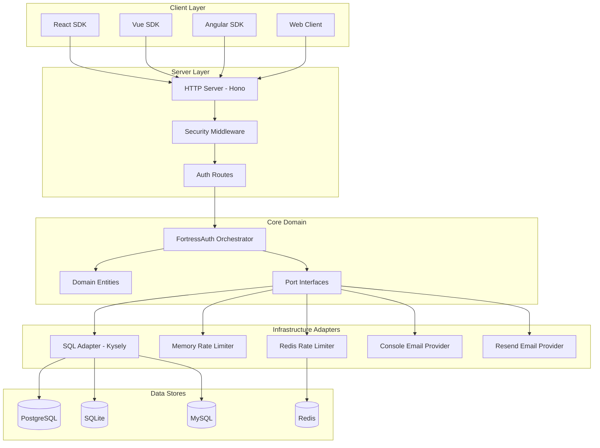
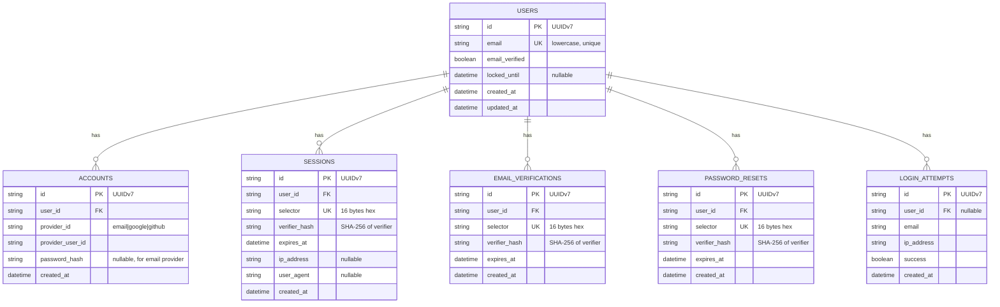
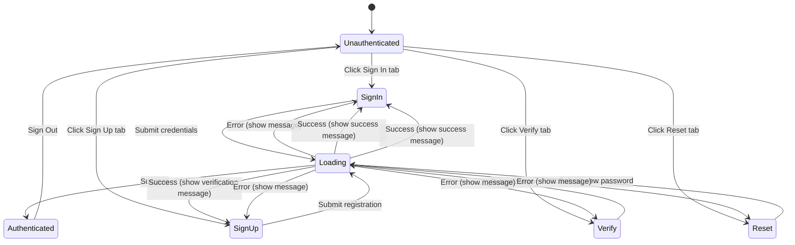
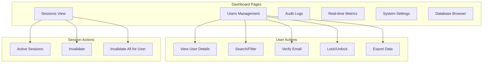

# Design Document: FortressAuth Platform

## Overview

FortressAuth is a secure-by-default, database-agnostic authentication library built with TypeScript and hexagonal architecture. This design document describes the architecture, components, data models, and implementation strategies for the platform.

The system follows a ports-and-adapters (hexagonal) architecture pattern, separating core business logic from infrastructure concerns. This enables database agnosticism, testability, and flexibility in deployment scenarios.

## Architecture

### High-Level Architecture



### Hexagonal Architecture Layers

1. **Domain Layer** (`packages/core/src/domain/`)
   - Pure business logic with no external dependencies
   - Domain entities: User, Account, Session, EmailVerificationToken, PasswordResetToken, LoginAttempt

2. **Application Layer** (`packages/core/src/fortress.ts`)
   - FortressAuth orchestrator coordinating authentication flows
   - Use case implementations for signup, signin, session validation, etc.

3. **Ports Layer** (`packages/core/src/ports/`)
   - Interface definitions for external dependencies
   - AuthRepository, RateLimiterPort, EmailProviderPort

4. **Adapters Layer** (`packages/adapter-sql/`, `packages/server/`)
   - Concrete implementations of port interfaces
   - SqlAdapter, MemoryRateLimiter, RedisRateLimiter, email providers

## Components and Interfaces

### Core Components

#### FortressAuth Orchestrator

The main entry point coordinating all authentication operations.

```typescript
interface FortressAuth {
  signUp(input: SignUpInput): Promise<Result<AuthResult, AuthErrorCode>>;
  signIn(input: SignInInput): Promise<Result<AuthResult, AuthErrorCode>>;
  signOut(rawToken: string): Promise<Result<void, AuthErrorCode>>;
  validateSession(rawToken: string): Promise<Result<{user: User, session: Session}, AuthErrorCode>>;
  verifyEmail(token: string): Promise<Result<void, AuthErrorCode>>;
  requestPasswordReset(email: string): Promise<Result<void, AuthErrorCode>>;
  resetPassword(input: ResetPasswordInput): Promise<Result<void, AuthErrorCode>>;
  getConfig(): Readonly<FortressConfig>;
}
```

#### Port Interfaces

```typescript
// Auth Repository Port
interface AuthRepository {
  // User operations
  findUserByEmail(email: string): Promise<User | null>;
  findUserById(id: string): Promise<User | null>;
  createUser(user: User): Promise<Result<void, 'EMAIL_EXISTS'>>;
  updateUser(user: User): Promise<void>;

  // Account operations
  findAccountByProvider(providerId: string, providerUserId: string): Promise<Account | null>;
  findEmailAccountByUserId(userId: string): Promise<Account | null>;
  createAccount(account: Account): Promise<void>;
  updateEmailAccountPassword(userId: string, passwordHash: string): Promise<void>;

  // Session operations
  findSessionBySelector(selector: string): Promise<Session | null>;
  createSession(session: Session): Promise<void>;
  deleteSession(sessionId: string): Promise<void>;
  deleteSessionsByUserId(userId: string): Promise<void>;

  // Token operations
  createEmailVerificationToken(token: EmailVerificationToken): Promise<void>;
  findEmailVerificationBySelector(selector: string): Promise<EmailVerificationToken | null>;
  deleteEmailVerification(id: string): Promise<void>;
  createPasswordResetToken(token: PasswordResetToken): Promise<void>;
  findPasswordResetBySelector(selector: string): Promise<PasswordResetToken | null>;
  deletePasswordReset(id: string): Promise<void>;

  // Audit operations
  recordLoginAttempt(attempt: LoginAttempt): Promise<void>;
  countRecentFailedAttempts(email: string, windowMs: number): Promise<number>;

  // Transaction support
  transaction<T>(fn: (repo: AuthRepository) => Promise<T>): Promise<T>;
}

// Rate Limiter Port
interface RateLimiterPort {
  check(identifier: string, action: string): Promise<{
    allowed: boolean;
    remaining: number;
    resetAt: Date;
    retryAfterMs: number;
  }>;
  consume(identifier: string, action: string): Promise<void>;
  reset(identifier: string, action: string): Promise<void>;
}

// Email Provider Port
interface EmailProviderPort {
  sendVerificationEmail(email: string, verificationLink: string): Promise<void>;
  sendPasswordResetEmail(email: string, resetLink: string): Promise<void>;
}
```

### Email Provider Implementations

FortressAuth provides built-in support for multiple email providers:

| Provider | Status | Package | Use Case |
|----------|--------|---------|----------|
| Console | ✅ Implemented | `@fortressauth/core` | Development/testing |
| Resend | ✅ Implemented | `@fortressauth/server` | Production |
| AWS SES | 🔨 Planned | `@fortressauth/email-ses` | Production (AWS) |
| SendGrid | 🔨 Planned | `@fortressauth/email-sendgrid` | Production |
| Nodemailer/SMTP | 🔨 Planned | `@fortressauth/email-smtp` | Self-hosted |
| Postmark | 🔨 Planned | `@fortressauth/email-postmark` | Production |
| Mailgun | 🔨 Planned | `@fortressauth/email-mailgun` | Production |

```typescript
// Example: Using AWS SES provider
import { SESEmailProvider } from '@fortressauth/email-ses';

const emailProvider = new SESEmailProvider({
  region: 'us-east-1',
  fromEmail: 'noreply@example.com',
  fromName: 'My App',
});

// Example: Using SendGrid provider
import { SendGridEmailProvider } from '@fortressauth/email-sendgrid';

const emailProvider = new SendGridEmailProvider({
  apiKey: process.env.SENDGRID_API_KEY,
  fromEmail: 'noreply@example.com',
  fromName: 'My App',
});

// Example: Custom provider implementation
class MyCustomEmailProvider implements EmailProviderPort {
  async sendVerificationEmail(email: string, link: string): Promise<void> {
    // Your custom implementation
  }
  async sendPasswordResetEmail(email: string, link: string): Promise<void> {
    // Your custom implementation
  }
}
```

### Security Components

#### Split Token Pattern

All tokens (sessions, email verification, password reset) use the split token pattern:

```typescript
interface SplitToken {
  selector: string;    // 16 bytes hex - used for database lookup
  verifier: string;    // 32 bytes hex - used for verification
  verifierHash: string; // SHA-256 hash of verifier - stored in database
  token: string;       // "selector:verifier" - sent to client
}
```

#### Password Hashing

```typescript
// Argon2id with OWASP-recommended parameters
const ARGON2_OPTIONS = {
  memoryCost: 19456,  // 19 MB
  timeCost: 2,        // 2 iterations
  parallelism: 1,     // 1 thread
};
```

## Data Models

### Entity Relationship Diagram



### Domain Entities

```typescript
// User Entity
class User {
  readonly id: string;
  readonly email: string;
  readonly emailVerified: boolean;
  readonly createdAt: Date;
  readonly updatedAt: Date;
  readonly lockedUntil: Date | null;

  static create(email: string): User;
  static rehydrate(data: UserData): User;
  isLocked(): boolean;
  withEmailVerified(): User;
  withLock(until: Date): User;
}

// Session Entity
class Session {
  readonly id: string;
  readonly userId: string;
  readonly selector: string;
  readonly verifierHash: string;
  readonly expiresAt: Date;
  readonly ipAddress?: string;
  readonly userAgent?: string;
  readonly createdAt: Date;

  static create(userId: string, ttlMs: number, ipAddress?: string, userAgent?: string): {
    session: Session;
    rawToken: string;
  };
  static parse(rawToken: string): { selector: string; verifier: string } | null;
  matchesVerifier(verifier: string): boolean;
  isExpired(): boolean;
}

// Account Entity
class Account {
  readonly id: string;
  readonly userId: string;
  readonly providerId: 'email' | 'google' | 'github';
  readonly providerUserId: string;
  readonly passwordHash: string | null;
  readonly createdAt: Date;

  static createEmailAccount(userId: string, email: string, passwordHash: string): Account;
  static createOAuthAccount(userId: string, provider: OAuthProviderId, providerUserId: string): Account;
}
```

## Correctness Properties

*A property is a characteristic or behavior that should hold true across all valid executions of a system—essentially, a formal statement about what the system should do. Properties serve as the bridge between human-readable specifications and machine-verifiable correctness guarantees.*


### Property 1: User Registration Creates Valid Records

*For any* valid email and password (meeting length requirements), calling signUp SHALL create a User record with the email normalized to lowercase and an associated Account record with a valid Argon2id password hash.

**Validates: Requirements 1.1, 1.5, 1.8**

### Property 2: Duplicate Email Prevention

*For any* existing user email, attempting to register with the same email (case-insensitive) SHALL return an EMAIL_EXISTS error without creating duplicate records.

**Validates: Requirements 1.2**

### Property 3: Password Length Validation

*For any* password shorter than minLength or longer than maxLength, signUp and resetPassword SHALL return a PASSWORD_TOO_WEAK error without processing the request.

**Validates: Requirements 1.3, 1.4, 5.7**

### Property 4: Session Token Format and Storage

*For any* successfully created session (via signUp or signIn), the returned token SHALL be in "selector:verifier" format where selector is 32 hex chars (16 bytes) and verifier is 64 hex chars (32 bytes), and only the SHA-256 hash of the verifier SHALL be stored in the database.

**Validates: Requirements 1.6, 2.1, 3.1, 3.2, 4.2, 5.3**

### Property 5: Authentication Round-Trip

*For any* user created with email E and password P, signing in with (E, P) SHALL succeed and return a valid session, while signing in with (E, P') where P' ≠ P SHALL return INVALID_CREDENTIALS.

**Validates: Requirements 2.1, 2.2**

### Property 6: Account Lockout Enforcement

*For any* locked account (lockedUntil > now), signIn SHALL return ACCOUNT_LOCKED without verifying the password. When lockedUntil ≤ now, the account SHALL be accessible for login attempts.

**Validates: Requirements 2.4, 7.2, 7.3**

### Property 7: Email Verification Requirement

*For any* user with emailVerified = false, signIn with valid credentials SHALL return EMAIL_NOT_VERIFIED.

**Validates: Requirements 2.5**

### Property 8: Login Attempt Recording

*For any* signIn attempt (successful or failed), a LoginAttempt record SHALL be created with the email, IP address, and success status.

**Validates: Requirements 2.6**

### Property 9: Session Expiration

*For any* session where expiresAt ≤ now, validateSession SHALL return SESSION_EXPIRED and delete the session from the database.

**Validates: Requirements 3.4**

### Property 10: Session Deletion on Signout

*For any* valid session token, calling signOut SHALL delete the session from the database, and subsequent validateSession calls with the same token SHALL return SESSION_INVALID.

**Validates: Requirements 3.5**

### Property 11: Email Verification Round-Trip

*For any* user with an EmailVerificationToken, calling verifyEmail with the raw token SHALL mark the user's emailVerified as true and delete the token.

**Validates: Requirements 4.3**

### Property 12: Token Expiration Handling

*For any* EmailVerificationToken or PasswordResetToken where expiresAt ≤ now, verification/reset SHALL return the appropriate EXPIRED error.

**Validates: Requirements 4.4, 5.6**

### Property 13: Invalid Token Rejection

*For any* malformed or non-existent token, verifyEmail and resetPassword SHALL return the appropriate INVALID error.

**Validates: Requirements 4.5**

### Property 14: Password Reset Email Enumeration Prevention

*For any* email (existing or non-existing), requestPasswordReset SHALL return success without revealing whether the email exists.

**Validates: Requirements 5.2**

### Property 15: Password Reset Invalidates Sessions

*For any* successful password reset, all existing sessions for that user SHALL be deleted.

**Validates: Requirements 5.5**

### Property 16: Rate Limiting Enforcement

*For any* action with rate limiting enabled, when the rate limit is exceeded, the operation SHALL return RATE_LIMIT_EXCEEDED before processing the request.

**Validates: Requirements 6.2, 6.5**

### Property 17: Account Lockout Lifecycle

*For any* user with lockout enabled, after maxFailedAttempts failed login attempts within the time window, the account SHALL be locked for lockoutDurationMs. After the duration expires, login attempts SHALL be allowed again.

**Validates: Requirements 7.1, 7.3, 7.4**

### Property 18: Token Entropy

*For any* generated token (session, email verification, password reset), the selector and verifier SHALL have sufficient cryptographic randomness (16 and 32 bytes respectively from crypto.randomBytes).

**Validates: Requirements 12.2**

### Property 19: No Sensitive Data in Responses

*For any* API response, password hashes, raw verifiers, and internal token data SHALL NOT be exposed.

**Validates: Requirements 12.5**

### Property 20: Input Sanitization

*For any* input containing null bytes, control characters, or exceeding maximum length limits, the operation SHALL reject the input before processing.

**Validates: Requirements 17.2, 17.3, 17.4**

### Property 21: Email Format Validation

*For any* email input that does not conform to RFC 5322 format, signUp and related operations SHALL reject the input.

**Validates: Requirements 17.1**

### Property 22: Production Error Message Safety

*For any* error response in production mode, the response SHALL NOT contain stack traces, internal paths, database error details, or user-specific information beyond the error code.

**Validates: Requirements 18.1, 18.5**

### Property 23: Development Error Detail

*For any* error response in development mode, the response SHALL include detailed debugging information including the specific error cause.

**Validates: Requirements 18.2**

### Property 24: Error Code Consistency

*For any* error response, the error code SHALL be present and SHALL map to a documented error in the reference table.

**Validates: Requirements 18.4**

## Error Handling

### Error Codes

The system uses a typed error code system for all authentication failures:

```typescript
type AuthErrorCode =
  | 'EMAIL_EXISTS'
  | 'INVALID_CREDENTIALS'
  | 'PASSWORD_TOO_WEAK'
  | 'ACCOUNT_LOCKED'
  | 'EMAIL_NOT_VERIFIED'
  | 'SESSION_INVALID'
  | 'SESSION_EXPIRED'
  | 'EMAIL_VERIFICATION_INVALID'
  | 'EMAIL_VERIFICATION_EXPIRED'
  | 'PASSWORD_RESET_INVALID'
  | 'PASSWORD_RESET_EXPIRED'
  | 'RATE_LIMIT_EXCEEDED'
  | 'INTERNAL_ERROR';
```

### Production vs Development Error Messages

To prevent information leakage to attackers, error responses differ between environments:

```typescript
// Development mode - detailed errors for debugging
{
  "success": false,
  "error": "INVALID_CREDENTIALS",
  "details": "Password hash verification failed for user@example.com",
  "timestamp": "2025-12-29T10:30:00Z"
}

// Production mode - generic errors, no internal details
{
  "success": false,
  "error": "INVALID_CREDENTIALS",
  "message": "Authentication failed. Please check your credentials.",
  "code": "AUTH_001"
}
```

### Error Code Reference

Developers can look up error codes in documentation:

| Code | Error | Production Message |
|------|-------|-------------------|
| AUTH_001 | INVALID_CREDENTIALS | Authentication failed. Please check your credentials. |
| AUTH_002 | EMAIL_EXISTS | Unable to complete registration. |
| AUTH_003 | PASSWORD_TOO_WEAK | Password does not meet requirements. |
| AUTH_004 | ACCOUNT_LOCKED | Account temporarily unavailable. |
| AUTH_005 | EMAIL_NOT_VERIFIED | Please verify your email to continue. |
| AUTH_006 | SESSION_INVALID | Session is invalid. Please sign in again. |
| AUTH_007 | SESSION_EXPIRED | Session has expired. Please sign in again. |
| AUTH_008 | RATE_LIMIT_EXCEEDED | Too many requests. Please try again later. |
| AUTH_009 | INTERNAL_ERROR | An unexpected error occurred. |

### Result Type Pattern

All operations return a discriminated union Result type:

```typescript
type Result<T, E> = 
  | { success: true; data: T }
  | { success: false; error: E };
```

### HTTP Status Code Mapping

| Error Code | HTTP Status |
|------------|-------------|
| EMAIL_EXISTS | 400 Bad Request |
| INVALID_CREDENTIALS | 401 Unauthorized |
| PASSWORD_TOO_WEAK | 400 Bad Request |
| ACCOUNT_LOCKED | 401 Unauthorized |
| EMAIL_NOT_VERIFIED | 403 Forbidden |
| SESSION_INVALID | 401 Unauthorized |
| SESSION_EXPIRED | 401 Unauthorized |
| EMAIL_VERIFICATION_INVALID | 400 Bad Request |
| EMAIL_VERIFICATION_EXPIRED | 410 Gone |
| PASSWORD_RESET_INVALID | 400 Bad Request |
| PASSWORD_RESET_EXPIRED | 410 Gone |
| RATE_LIMIT_EXCEEDED | 429 Too Many Requests |
| INTERNAL_ERROR | 500 Internal Server Error |

## Testing Strategy

### Dual Testing Approach

The testing strategy combines unit tests and property-based tests for comprehensive coverage:

1. **Unit Tests**: Verify specific examples, edge cases, and error conditions
2. **Property-Based Tests**: Verify universal properties across all valid inputs

### Property-Based Testing Framework

- **Library**: fast-check (TypeScript property-based testing library)
- **Minimum Iterations**: 100 per property test
- **Tag Format**: `Feature: fortressauth-platform, Property {number}: {property_text}`

### Test Organization

```
packages/core/src/__tests__/
├── domain/
│   ├── user.test.ts
│   ├── session.test.ts
│   └── account.test.ts
├── security/
│   ├── password.test.ts
│   ├── tokens.test.ts
│   └── tokens.property.test.ts
├── fortress.test.ts
└── fortress.property.test.ts
```

### Property Test Examples

```typescript
// Property 4: Session Token Format
describe('Property 4: Session Token Format and Storage', () => {
  it('should generate tokens in selector:verifier format with correct lengths', () => {
    fc.assert(
      fc.property(fc.uuid(), fc.integer({ min: 1000, max: 86400000 }), (userId, ttlMs) => {
        const { session, rawToken } = Session.create(userId, ttlMs);
        const [selector, verifier] = rawToken.split(':');
        
        // Selector is 32 hex chars (16 bytes)
        expect(selector).toHaveLength(32);
        expect(/^[0-9a-f]+$/.test(selector)).toBe(true);
        
        // Verifier is 64 hex chars (32 bytes)
        expect(verifier).toHaveLength(64);
        expect(/^[0-9a-f]+$/.test(verifier)).toBe(true);
        
        // Only hash is stored
        expect(session.verifierHash).not.toBe(verifier);
        expect(session.verifierHash).toBe(hashVerifier(verifier));
      }),
      { numRuns: 100 }
    );
  });
});

// Property 5: Authentication Round-Trip
describe('Property 5: Authentication Round-Trip', () => {
  it('should authenticate with correct credentials and reject incorrect ones', () => {
    fc.assert(
      fc.property(
        fc.emailAddress(),
        fc.string({ minLength: 8, maxLength: 128 }),
        fc.string({ minLength: 8, maxLength: 128 }),
        async (email, correctPassword, wrongPassword) => {
          fc.pre(correctPassword !== wrongPassword);
          
          // Setup: create user
          const signUpResult = await fortress.signUp({ email, password: correctPassword });
          expect(signUpResult.success).toBe(true);
          
          // Verify email for login
          // ... verification logic ...
          
          // Correct password succeeds
          const correctResult = await fortress.signIn({ email, password: correctPassword });
          expect(correctResult.success).toBe(true);
          
          // Wrong password fails
          const wrongResult = await fortress.signIn({ email, password: wrongPassword });
          expect(wrongResult.success).toBe(false);
          expect(wrongResult.error).toBe('INVALID_CREDENTIALS');
        }
      ),
      { numRuns: 100 }
    );
  });
});
```

### Unit Test Coverage

Unit tests focus on:
- Specific edge cases (empty strings, boundary values)
- Error condition handling
- Integration points between components
- Database adapter behavior
- HTTP endpoint responses

### Test Data Generators

Custom generators for domain-specific data:

```typescript
const emailArbitrary = fc.emailAddress();
const passwordArbitrary = fc.string({ minLength: 8, maxLength: 128 });
const splitTokenArbitrary = fc.tuple(
  fc.hexaString({ minLength: 32, maxLength: 32 }),
  fc.hexaString({ minLength: 64, maxLength: 64 })
).map(([selector, verifier]) => `${selector}:${verifier}`);
```

### Coverage Requirements

- **Target**: >95% coverage across all packages
- **Measurement**: Istanbul/nyc for coverage reporting
- **CI Integration**: Coverage gates in GitHub Actions
- **Per-Package Reporting**: Each package reports coverage independently

```yaml
# Example CI coverage configuration
coverage:
  threshold:
    global:
      branches: 95
      functions: 95
      lines: 95
      statements: 95
```

## Landing Site Architecture

### Pages Structure

```
landing/
├── src/
│   ├── app/
│   │   ├── page.tsx           # Marketing homepage
│   │   ├── docs/              # API documentation
│   │   ├── changelog/         # Version history
│   │   ├── about/             # Project info
│   │   └── pricing/           # Pricing tiers (if applicable)
│   ├── components/
│   └── messages/              # i18n translations
```

### Internationalization

The landing site supports multiple languages via next-intl:

```typescript
// messages/en.json
{
  "hero": {
    "title": "Secure Authentication Made Simple",
    "subtitle": "Database-agnostic, TypeScript-first auth library"
  }
}

// messages/es.json
{
  "hero": {
    "title": "Autenticación Segura Simplificada",
    "subtitle": "Biblioteca de autenticación TypeScript agnóstica de base de datos"
  }
}
```

### Accessibility

- WCAG 2.1 AA compliance
- Semantic HTML structure
- Keyboard navigation support
- Screen reader compatibility
- Color contrast ratios ≥ 4.5:1

## Secrets Management Architecture

### Overview

FortressAuth provides a pluggable secrets management system that supports multiple backends for different deployment scenarios.

### Secrets Provider Interface

```typescript
interface SecretsProviderPort {
  getSecret(key: string): Promise<string | undefined>;
  getRequiredSecret(key: string): Promise<string>;
  hasSecret(key: string): Promise<boolean>;
  // For providers that support rotation
  onSecretRotation?(callback: (key: string, newValue: string) => void): void;
}
```

### Supported Backends

| Provider | Status | Use Case |
|----------|--------|----------|
| Environment Variables | ✅ Implemented | Default, all environments |
| .env Files (dotenv) | ✅ Implemented | Local development |
| AWS Secrets Manager | 🔨 Planned | AWS production |
| HashiCorp Vault | 🔨 Planned | Enterprise/multi-cloud |
| Azure Key Vault | 🔨 Planned | Azure production |
| GCP Secret Manager | 🔨 Planned | GCP production |

### Required Secrets

The following secrets must be configured:

| Secret | Description | Required |
|--------|-------------|----------|
| `DATABASE_URL` | Database connection string | Yes |
| `REDIS_URL` | Redis connection string (if using Redis rate limiter) | No |
| `RESEND_API_KEY` | Resend API key (if using Resend email) | Conditional |
| `SENDGRID_API_KEY` | SendGrid API key (if using SendGrid email) | Conditional |
| `AWS_ACCESS_KEY_ID` | AWS credentials (if using SES) | Conditional |
| `AWS_SECRET_ACCESS_KEY` | AWS credentials (if using SES) | Conditional |

### Secret Validation

At startup, FortressAuth validates all required secrets:

```typescript
// Startup validation
const secrets = await secretsProvider.validate([
  { key: 'DATABASE_URL', required: true },
  { key: 'REDIS_URL', required: config.rateLimit.backend === 'redis' },
  { key: 'RESEND_API_KEY', required: config.email.provider === 'resend' },
]);

if (!secrets.valid) {
  console.error('Missing required secrets:', secrets.missing);
  process.exit(1);
}
```

### Health Check Endpoint

```typescript
// GET /health/secrets
{
  "status": "ok",
  "secrets": {
    "DATABASE_URL": "configured",
    "REDIS_URL": "not_configured",
    "RESEND_API_KEY": "configured"
  }
}
```

### Secret Rotation Support

For providers that support it (AWS Secrets Manager, Vault), FortressAuth can handle secret rotation:

```typescript
secretsProvider.onSecretRotation((key, newValue) => {
  if (key === 'DATABASE_URL') {
    // Reconnect database with new credentials
    database.reconnect(newValue);
  }
});
```

## Deployment Architecture

### Railway Deployment (Primary)

Railway provides a simple, cost-effective deployment option with managed PostgreSQL and Redis.

```
┌─────────────────────────────────────────────────────────┐
│                      Railway                             │
│  ┌─────────────────┐  ┌─────────────┐  ┌─────────────┐ │
│  │  FortressAuth   │  │  PostgreSQL │  │    Redis    │ │
│  │     Server      │──│   (managed) │  │  (managed)  │ │
│  │   (Node.js)     │  │             │  │             │ │
│  └─────────────────┘  └─────────────┘  └─────────────┘ │
└─────────────────────────────────────────────────────────┘
         │
         ▼
┌─────────────────────────────────────────────────────────┐
│                       Vercel                             │
│  ┌─────────────────────────────────────────────────────┐│
│  │              Landing Site (Next.js)                 ││
│  │         Marketing | Docs | Changelog                ││
│  └─────────────────────────────────────────────────────┘│
└─────────────────────────────────────────────────────────┘
```

### Railway Configuration

```toml
# railway.toml
[build]
builder = "dockerfile"
dockerfilePath = "docker/Dockerfile"

[deploy]
healthcheckPath = "/health"
healthcheckTimeout = 30
restartPolicyType = "on_failure"
restartPolicyMaxRetries = 3
```

```json
// railway.json
{
  "$schema": "https://railway.app/railway.schema.json",
  "build": {
    "builder": "DOCKERFILE",
    "dockerfilePath": "docker/Dockerfile"
  },
  "deploy": {
    "healthcheckPath": "/health",
    "healthcheckTimeout": 30,
    "restartPolicyType": "ON_FAILURE",
    "restartPolicyMaxRetries": 3
  }
}
```

### Environment Variables for Railway

```bash
# Required
DATABASE_URL=postgresql://... # Auto-injected by Railway PostgreSQL
NODE_ENV=production

# Optional - Rate Limiting
REDIS_URL=redis://... # Auto-injected by Railway Redis

# Optional - Email
EMAIL_PROVIDER=resend
RESEND_API_KEY=re_...
EMAIL_FROM_ADDRESS=noreply@yourdomain.com

# Server Config
PORT=3000
HOST=0.0.0.0
BASE_URL=https://your-app.railway.app
CORS_ORIGINS=https://yourdomain.com
```

### AWS Deployment (Planned)

For production scale, FortressAuth will support AWS deployment:

```
┌─────────────────────────────────────────────────────────┐
│                         AWS                              │
│  ┌─────────────┐  ┌─────────────┐  ┌─────────────────┐ │
│  │     ALB     │  │    ECS      │  │   RDS           │ │
│  │  (Load      │──│  Fargate    │──│  PostgreSQL     │ │
│  │  Balancer)  │  │             │  │                 │ │
│  └─────────────┘  └─────────────┘  └─────────────────┘ │
│                          │                              │
│                   ┌──────┴──────┐                       │
│                   │ ElastiCache │                       │
│                   │   (Redis)   │                       │
│                   └─────────────┘                       │
└─────────────────────────────────────────────────────────┘
```

### Docker Configuration

The existing Dockerfile supports both Railway and AWS deployments:

```dockerfile
# docker/Dockerfile (existing)
FROM node:20-alpine
WORKDIR /app
# ... build steps ...
EXPOSE 3000
CMD ["node", "packages/server/dist/index.js"]
```

### Health Checks

The server provides health check endpoints for container orchestration:

```typescript
// GET /health - Basic health check
{
  "status": "ok",
  "version": "0.1.9",
  "timestamp": "2025-12-29T10:30:00Z"
}

// GET /health (degraded)
{
  "status": "degraded",
  "version": "0.1.9",
  "timestamp": "2025-12-29T10:30:00Z"
}
```

### Graceful Shutdown

The server handles SIGTERM and SIGINT for zero-downtime deployments:

```typescript
process.on('SIGTERM', () => gracefulShutdown('SIGTERM'));
process.on('SIGINT', () => gracefulShutdown('SIGINT'));

function gracefulShutdown(signal: string): void {
  console.log(`${signal} received. Shutting down gracefully...`);
  // Close database connections
  // Close Redis connections
  // Wait for in-flight requests
  process.exit(0);
}
```

## AI/LLM Developer Experience

### Strategy for LLM Discoverability

To position FortressAuth as the default auth library for AI-powered coding, we optimize for:

1. **Discoverability** - LLMs find us when developers ask about authentication
2. **Learnability** - LLMs can quickly understand our API patterns
3. **Usability** - Generated code works correctly on first try

### llms.txt Standard

Create `/llms.txt` at the documentation root following the [llms.txt standard](https://llmstxt.org/):

```text
# FortressAuth

> Secure-by-default, database-agnostic authentication library for TypeScript

## Quick Start

npm install @fortressauth/core @fortressauth/adapter-sql

## Core Concepts

- FortressAuth: Main orchestrator class
- Split tokens: Secure session management
- Ports & Adapters: Database agnostic design

## Common Patterns

### Basic Setup
[code example]

### React Integration
[code example]

### Password Reset Flow
[code example]

## API Reference

[link to full docs]
```

### AI Assistant Configuration

Create `.cursorrules` for Cursor IDE and similar:

```text
# FortressAuth Project Rules

When working with authentication in this project:
1. Use @fortressauth/core for auth logic
2. Use @fortressauth/adapter-sql for database
3. Use @fortressauth/react-sdk for React apps
4. All passwords use Argon2id hashing
5. Sessions use split-token pattern
6. Always validate inputs before processing

Common imports:
- import { FortressAuth } from '@fortressauth/core'
- import { SqlAdapter } from '@fortressauth/adapter-sql'
- import { useAuth } from '@fortressauth/react-sdk'
```

### JSDoc Standards

All public APIs include comprehensive JSDoc:

```typescript
/**
 * Creates a new user account with email/password authentication.
 * 
 * @param input - Registration details
 * @param input.email - User's email address (will be normalized to lowercase)
 * @param input.password - Password (must meet configured length requirements)
 * @param input.ipAddress - Optional IP address for audit logging
 * @param input.userAgent - Optional user agent for session metadata
 * 
 * @returns Success with user and session token, or error code
 * 
 * @example
 * ```typescript
 * const result = await fortress.signUp({
 *   email: 'user@example.com',
 *   password: 'securePassword123',
 *   ipAddress: req.ip
 * });
 * 
 * if (result.success) {
 *   // Set session cookie
 *   setCookie('session', result.data.token);
 * } else {
 *   // Handle error: EMAIL_EXISTS, PASSWORD_TOO_WEAK, RATE_LIMIT_EXCEEDED
 *   console.error(result.error);
 * }
 * ```
 */
async signUp(input: SignUpInput): Promise<Result<AuthResult, AuthErrorCode>>
```

## MCP Server Architecture

### Overview

The FortressAuth MCP (Model Context Protocol) server enables AI assistants like Claude, ChatGPT, and Cursor to directly interact with the authentication system. This allows developers to manage users, sessions, and auth configuration through natural language.

### Package Structure

```
packages/mcp-server/
├── src/
│   ├── index.ts           # MCP server entry point
│   ├── tools/
│   │   ├── users.ts       # User management tools
│   │   ├── sessions.ts    # Session management tools
│   │   └── auth.ts        # Auth operation tools
│   ├── resources/
│   │   ├── config.ts      # Auth configuration resource
│   │   ├── metrics.ts     # System metrics resource
│   │   └── schema.ts      # Database schema resource
│   └── prompts/
│       └── templates.ts   # Prompt templates for common tasks
├── package.json
└── tsconfig.json
```

### MCP Tools

Tools are functions that AI assistants can execute:

```typescript
// User Management Tools
const tools = [
  {
    name: 'fortress_create_user',
    description: 'Create a new user account with email and password',
    inputSchema: {
      type: 'object',
      properties: {
        email: { type: 'string', description: 'User email address' },
        password: { type: 'string', description: 'User password' },
      },
      required: ['email', 'password'],
    },
  },
  {
    name: 'fortress_get_user',
    description: 'Get user details by email or ID',
    inputSchema: {
      type: 'object',
      properties: {
        email: { type: 'string', description: 'User email address' },
        userId: { type: 'string', description: 'User ID' },
      },
    },
  },
  {
    name: 'fortress_list_users',
    description: 'List all users with optional filtering',
    inputSchema: {
      type: 'object',
      properties: {
        limit: { type: 'number', description: 'Max users to return' },
        offset: { type: 'number', description: 'Pagination offset' },
        verified: { type: 'boolean', description: 'Filter by email verified status' },
      },
    },
  },
  {
    name: 'fortress_verify_email',
    description: 'Manually verify a user email address',
    inputSchema: {
      type: 'object',
      properties: {
        userId: { type: 'string', description: 'User ID to verify' },
      },
      required: ['userId'],
    },
  },
  {
    name: 'fortress_lock_user',
    description: 'Lock a user account',
    inputSchema: {
      type: 'object',
      properties: {
        userId: { type: 'string', description: 'User ID to lock' },
        duration: { type: 'number', description: 'Lock duration in minutes' },
      },
      required: ['userId'],
    },
  },
  {
    name: 'fortress_unlock_user',
    description: 'Unlock a locked user account',
    inputSchema: {
      type: 'object',
      properties: {
        userId: { type: 'string', description: 'User ID to unlock' },
      },
      required: ['userId'],
    },
  },
  {
    name: 'fortress_validate_session',
    description: 'Validate a session token',
    inputSchema: {
      type: 'object',
      properties: {
        token: { type: 'string', description: 'Session token to validate' },
      },
      required: ['token'],
    },
  },
  {
    name: 'fortress_invalidate_sessions',
    description: 'Invalidate all sessions for a user',
    inputSchema: {
      type: 'object',
      properties: {
        userId: { type: 'string', description: 'User ID' },
      },
      required: ['userId'],
    },
  },
];
```

### MCP Resources

Resources provide read-only data to AI assistants:

```typescript
const resources = [
  {
    uri: 'fortress://config',
    name: 'FortressAuth Configuration',
    description: 'Current authentication configuration settings',
    mimeType: 'application/json',
  },
  {
    uri: 'fortress://metrics',
    name: 'System Metrics',
    description: 'Real-time authentication metrics (active sessions, login rates)',
    mimeType: 'application/json',
  },
  {
    uri: 'fortress://schema',
    name: 'Database Schema',
    description: 'Auth database table schemas',
    mimeType: 'application/json',
  },
  {
    uri: 'fortress://users/{userId}',
    name: 'User Details',
    description: 'Detailed information about a specific user',
    mimeType: 'application/json',
  },
];
```

### MCP Server Configuration

```json
// mcp.json configuration for AI assistants
{
  "mcpServers": {
    "fortressauth": {
      "command": "npx",
      "args": ["@fortressauth/mcp-server"],
      "env": {
        "DATABASE_URL": "postgresql://...",
        "FORTRESS_ADMIN_KEY": "your-admin-key"
      }
    }
  }
}
```

### Usage Example

Once configured, developers can interact with FortressAuth through their AI assistant:

```
Developer: "Create a new user with email test@example.com"
AI: [Calls fortress_create_user tool]
    "Created user test@example.com with ID usr_abc123"

Developer: "Show me all unverified users"
AI: [Calls fortress_list_users with verified=false]
    "Found 3 unverified users: ..."

Developer: "Lock the user who has been making too many failed login attempts"
AI: [Calls fortress_lock_user tool]
    "Locked user usr_xyz789 for 15 minutes"
```

## Example Applications Architecture

### Overview

FortressAuth provides example applications for each supported framework (React, Svelte, Vue, Angular, Expo, Electron) with a unified UI design. The React example serves as the design template/standard that all other examples follow.

### Unified Design System

All example applications share a consistent visual design:

```
┌─────────────────────────────────────────────────────────┐
│                    FortressAuth Demo                     │
│                      [Framework Logo]                    │
├─────────────────────────────────────────────────────────┤
│  ┌─────────┐ ┌─────────┐ ┌─────────┐ ┌─────────┐       │
│  │ Sign In │ │ Sign Up │ │ Verify  │ │  Reset  │       │
│  └─────────┘ └─────────┘ └─────────┘ └─────────┘       │
├─────────────────────────────────────────────────────────┤
│                                                          │
│  Email                                                   │
│  ┌─────────────────────────────────────────────────┐   │
│  │ your@email.com                                   │   │
│  └─────────────────────────────────────────────────┘   │
│                                                          │
│  Password                                                │
│  ┌─────────────────────────────────────────────────┐   │
│  │ ••••••••                                         │   │
│  └─────────────────────────────────────────────────┘   │
│                                                          │
│  ┌─────────────────────────────────────────────────┐   │
│  │              Sign In                             │   │
│  └─────────────────────────────────────────────────┘   │
│                                                          │
│  Forgot password?                                        │
│                                                          │
└─────────────────────────────────────────────────────────┘
```

### Design Tokens

| Token | Value | Usage |
|-------|-------|-------|
| `--color-primary` | `#3b82f6` (blue-500) | Primary buttons, links |
| `--color-primary-hover` | `#2563eb` (blue-600) | Button hover states |
| `--color-secondary` | `#6b7280` (gray-500) | Secondary buttons |
| `--color-background` | `#1a1a2e` | Page background |
| `--color-surface` | `#16213e` | Card/form background |
| `--color-text` | `#e2e8f0` | Primary text |
| `--color-text-muted` | `#a0aec0` | Secondary text |
| `--color-error` | `#ef4444` (red-500) | Error messages |
| `--color-success` | `#22c55e` (green-500) | Success messages |
| `--font-family` | `system-ui, sans-serif` | All text |
| `--border-radius` | `8px` | Inputs, buttons, cards |
| `--spacing-unit` | `8px` | Base spacing multiplier |

### Form Validation Patterns

All examples implement consistent client-side validation:

```typescript
interface ValidationRules {
  email: {
    required: true;
    pattern: /^[^\s@]+@[^\s@]+\.[^\s@]+$/;
    message: 'Please enter a valid email address';
  };
  password: {
    required: true;
    minLength: 8;
    maxLength: 128;
    message: 'Password must be 8-128 characters';
  };
  confirmPassword: {
    required: true;
    matchField: 'password';
    message: 'Passwords do not match';
  };
  token: {
    required: true;
    pattern: /^[a-f0-9]{32}:[a-f0-9]{64}$/;
    message: 'Invalid token format';
  };
}
```

### User Feedback Patterns

Examples use consistent feedback mechanisms:

```typescript
// Success feedback
interface SuccessMessage {
  type: 'success';
  message: string;
  duration?: number; // Auto-dismiss after ms
}

// Error feedback
interface ErrorMessage {
  type: 'error';
  message: string;
  field?: string; // For field-specific errors
}

// Loading states
interface LoadingState {
  isLoading: boolean;
  loadingText?: string; // e.g., "Signing in...", "Creating account..."
}
```

### Alert/Dialog Components

Each framework implements equivalent alert/dialog patterns:

| State | Display | Example Message |
|-------|---------|-----------------|
| Success (signup) | Green alert | "Verification email sent! Check your inbox." |
| Success (signin) | Redirect | Redirect to authenticated view |
| Success (verify) | Green alert | "Email verified! You can now sign in." |
| Success (reset request) | Green alert | "Password reset email sent." |
| Success (reset) | Green alert | "Password reset successful. Please sign in." |
| Error (validation) | Red text below field | "Please enter a valid email address" |
| Error (API) | Red alert | Error message from server |
| Loading | Disabled button + spinner | "Signing in..." |

### CORS Configuration

Examples connect to the FortressAuth server with proper CORS handling:

```typescript
// Example configuration
const config = {
  // Development: direct connection to local server
  baseUrl: import.meta.env.VITE_API_URL || 'http://localhost:5001',
  
  // Credentials must be included for cookie-based sessions
  credentials: 'include' as const,
  
  // Headers for JSON API
  headers: {
    'Content-Type': 'application/json',
  },
};
```

Server CORS configuration (already in packages/server):

```typescript
// CORS middleware configuration
{
  origin: process.env.CORS_ORIGINS?.split(',') || ['http://localhost:5173'],
  credentials: true,
  methods: ['GET', 'POST', 'PUT', 'DELETE', 'OPTIONS'],
  allowedHeaders: ['Content-Type', 'Authorization'],
}
```

### Environment Variable Configuration

Each example uses framework-appropriate environment variables:

| Framework | Env File | Variable | Example |
|-----------|----------|----------|---------|
| React (Vite) | `.env` | `VITE_API_URL` | `http://localhost:5001` |
| Svelte | `.env` | `VITE_API_URL` | `http://localhost:5001` |
| Vue | `.env` | `VITE_API_URL` | `http://localhost:5001` |
| Angular | `environment.ts` | `apiUrl` | `http://localhost:5001` |
| Expo | `.env` | `EXPO_PUBLIC_API_URL` | `http://localhost:5001` |
| Electron | `.env` | `VITE_API_URL` | `http://localhost:5001` |

### Authentication Flow States



### Authenticated View

When a user is authenticated, all examples display:

```
┌─────────────────────────────────────────────────────────┐
│                    FortressAuth Demo                     │
│                      [Framework Logo]                    │
├─────────────────────────────────────────────────────────┤
│                                                          │
│  Welcome, user@example.com!                              │
│                                                          │
│  Email verified: ✅ Yes / ❌ No                          │
│                                                          │
│  ┌─────────────────────────────────────────────────┐   │
│  │              Sign Out                            │   │
│  └─────────────────────────────────────────────────┘   │
│                                                          │
└─────────────────────────────────────────────────────────┘
```

### Accessibility Requirements

All examples must meet WCAG 2.1 AA:

- Form labels associated with inputs via `for`/`id`
- Error messages linked to inputs via `aria-describedby`
- Focus management after form submission
- Keyboard navigation for all interactive elements
- Color contrast ratio ≥ 4.5:1 for text
- Loading states announced to screen readers

### Example Directory Structure

```
examples/
├── shared/                  # Shared resources for all examples
│   ├── assets/
│   │   └── logo.svg         # Shared FortressAuth logo
│   ├── styles/
│   │   ├── index.css        # Main entry point (imports all styles)
│   │   ├── design-tokens.css # CSS custom properties (colors, spacing, etc.)
│   │   ├── base.css         # Base/reset styles
│   │   ├── components.css   # Shared component styles
│   │   └── responsive.css   # Responsive breakpoints
│   └── utils/
│       └── validation.ts    # Shared validation utilities
├── web-react/               # React + Vite (template/standard)
│   ├── src/
│   │   ├── App.tsx
│   │   ├── main.tsx
│   │   └── styles.css       # Imports from ../shared/styles/index.css
│   ├── .env.example
│   └── package.json
├── web-svelte/              # SvelteKit
├── web-vue/                 # Vue 3 + Vite
├── web-angular/             # Angular 17+
├── mobile-expo/             # React Native + Expo
├── desktop-electron/        # Electron + React
└── basic-usage/             # Node.js CLI example
```

### Shared Resources

All example applications import from the shared folder:

**Styles** (`examples/shared/styles/`):
- `design-tokens.css` - CSS custom properties for colors, typography, spacing
- `base.css` - Reset and base element styles
- `components.css` - Shared component styles (buttons, inputs, alerts)
- `responsive.css` - Media queries and responsive utilities
- `index.css` - Main entry point that imports all above

**Utilities** (`examples/shared/utils/`):
- `validation.ts` - Form validation functions (email, password, token format)

**Assets** (`examples/shared/assets/`):
- `logo.svg` - FortressAuth logo used across all examples

## Admin Dashboard Architecture

### Overview

The admin dashboard (`dashboard/`) provides a web interface for managing users, sessions, and authentication settings.

### Technology Stack

- **Framework**: Next.js 14+ (App Router)
- **UI**: shadcn/ui + Tailwind CSS
- **State**: TanStack Query for server state
- **Auth**: FortressAuth (dogfooding)
- **Charts**: Recharts for metrics visualization

### Project Structure

```
dashboard/
├── src/
│   ├── app/
│   │   ├── (auth)/
│   │   │   ├── login/
│   │   │   └── layout.tsx
│   │   ├── (dashboard)/
│   │   │   ├── users/
│   │   │   │   ├── page.tsx        # User list
│   │   │   │   └── [id]/page.tsx   # User detail
│   │   │   ├── sessions/
│   │   │   ├── logs/
│   │   │   ├── settings/
│   │   │   └── layout.tsx
│   │   └── api/
│   │       └── admin/              # Admin API routes
│   ├── components/
│   │   ├── users/
│   │   ├── sessions/
│   │   └── charts/
│   └── lib/
│       ├── api.ts                  # API client
│       └── auth.ts                 # Admin auth
├── package.json
└── next.config.ts
```

### Dashboard Features



### Admin API Endpoints

The dashboard communicates with the server via admin API endpoints:

```typescript
// Admin API routes (added to server)
GET    /admin/users              # List users with pagination
GET    /admin/users/:id          # Get user details
PATCH  /admin/users/:id          # Update user (verify email, lock/unlock)
DELETE /admin/users/:id/sessions # Invalidate all sessions
GET    /admin/sessions           # List active sessions
DELETE /admin/sessions/:id       # Invalidate specific session
GET    /admin/logs               # Audit logs with filtering
GET    /admin/metrics            # Real-time metrics
GET    /admin/tables/:table      # Database table browser
POST   /admin/export/users       # Export user data (GDPR)
```

### Role-Based Access Control

```typescript
type AdminRole = 'viewer' | 'editor' | 'admin';

const permissions = {
  viewer: ['read:users', 'read:sessions', 'read:logs', 'read:metrics'],
  editor: ['read:*', 'write:users', 'write:sessions'],
  admin: ['*'],
};
```

### Deployment Options

1. **Standalone**: Deploy dashboard separately, connect to server API
2. **Embedded**: Mount dashboard routes within the main server
3. **Vercel**: Deploy to Vercel alongside landing site
